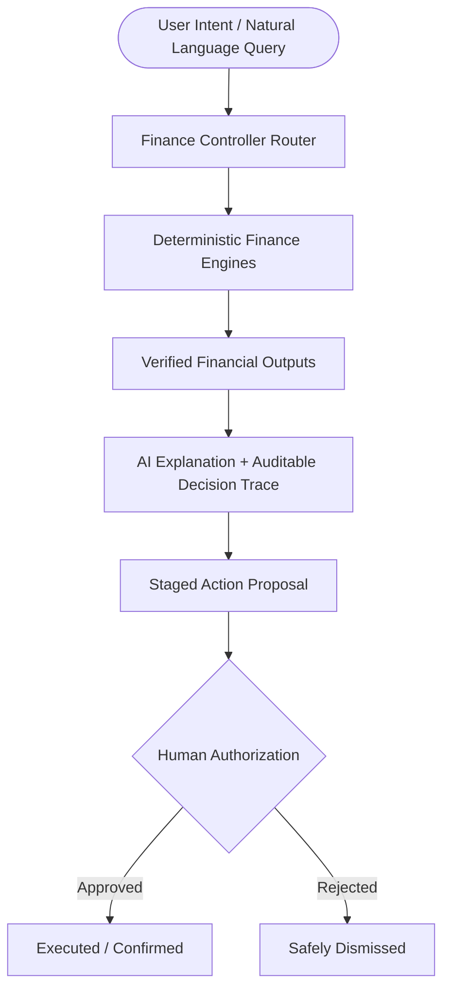

# FINEXFLY — AI Finance Controller

> Traditional finance dashboards show the past. Generic AI assistants can explain finance, but they should not be trusted to invent financial arithmetic.
>
> FINEXFLY separates calculation from explanation: deterministic finance engines calculate the financial truth first, while AI explains verified outputs, creates auditable Decision Traces, and stages actions for human authorization.

[](https://nextjs.org/)
[](https://react.dev/)
[](https://www.typescriptlang.org/)
[](https://supabase.com/)
[]()
[]()
[]()
[](https://finexfly.vercel.app)

---

### Core Highlights
- **Deterministic Financial Arithmetic**: Core financial metrics are calculated via audited TypeScript functions outside the LLM.
- **50+ Record Reconciliation Benchmark**: 60 synthetic gateway records evaluated against 58 bank settlements with deterministic exception classification.
- **AI Finance Controller**: Natural language interface that acts as an intent router and grounded explanation layer rather than an arithmetic calculator.
- **12-Month Forward Digital Twin**: Scenario simulation sandbox with mathematical proof preserving accounting identities.
- **REAL / DEMO / EMPTY Data Architecture**: Strict state boundaries ensuring user data, isolated sandbox data, and zero-data states never mix.
- **Human-in-the-Loop Actions**: Financial actions and simulation variables are staged for explicit operator authorization, preventing autonomous executions.
- **Supabase-Backed Data Isolation**: User and organization data boundaries enforced via PostgreSQL Row Level Security (RLS).

---

## The Core Idea



> **"FINEXFLY does not use an LLM as the source of truth for financial arithmetic."**

1. **AI interprets intent**: Natural-language prompts are analyzed to identify user intent (`RUNWAY`, `RECONCILIATION`, `SCENARIO`, `TAX`, `ANOMALY`, `OVERVIEW`) and select deterministic tools.
2. **Deterministic TypeScript engines perform calculations**: Financial arithmetic is deterministically computed outside the LLM using audited math modules.
3. **AI receives computed results**: The language model receives strictly verified outputs and formats the conversational explanation around those exact figures.
4. **Decision Traces record the reasoning context**: Every output is paired with an auditable Decision Trace capturing tool parameters, mathematical formulas, grounded metrics, and validation status.
5. **Financial actions are staged rather than silently executed**: Suggestions (e.g., applying scenario adjustments or reviewing reconciliations) are queued as staged action proposals.
6. **Human authorization is required**: Actions require explicit user confirmation before any system or state change is applied.

---

## 50+ Record Deterministic Reconciliation Benchmark

FINEXFLY includes a deterministic synthetic Razorpay-style reconciliation benchmark designed to stress-test two-way ledger verification. Payment gateways and core bank settlement accounts routinely diverge due to payment processor fees, webhook delivery retries, processing delays, and unmapped bank inflows.

Rather than forcing discrepancies into an artificial match, FINEXFLY classifies and surfaces every exception for human investigation:

| Metric | Result |
|---|---:|
| Gateway records | 60 |
| Bank settlement records | 58 |
| Evaluated entities | 60 |
| Matched pairs | 49 |
| Unresolved exceptions | 11 |
| **Deterministic match rate** | **81.7%** |

### Mathematical Definition
$$\text{Deterministic Match Rate} = \frac{\text{Matched Pairs}}{\text{Evaluated Entities}} \times 100 = \frac{49}{60} \times 100 = 81.7\%$$

> **"81.7% deterministic match rate across 60 evaluated gateway entities. The match rate is a reconciliation metric, not a universal accuracy claim."**

### Exception Breakdown

| Exception Category | Count |
|---|---:|
| MDR_FEE_VARIANCE | 3 |
| DUPLICATE_WEBHOOK | 2 |
| MISSING_IN_BANK | 2 |
| UNKNOWN_BANK_CREDIT / UNKNOWN_BANK_TXN | 4 |
| **Total unresolved exceptions** | **11** |

FINEXFLY intentionally surfaces unresolved exceptions rather than forcing every record into MATCHED.

> **"Exceptions are treated as first-class financial signals for human review."**

#### Verified Code Examples:
1. **`setl_5E`**
   - Gateway expectation: ₹4,900
   - Bank settlement: ₹4,895
   - Variance: ₹5
   - Classification: MDR fee variance
2. **`pay_6F`**
   - Duplicate webhook callbacks
   - Two gateway callbacks
   - One bank credit
3. **`txn_106`**
   - Unknown bank credit
   - Amount: ₹10,000

### Why the Benchmark Matters
The benchmark demonstrates:
- **batch processing at 50+ records**
- **deterministic matching**
- **mathematical match-rate calculation**
- **exception classification**
- **duplicate detection**
- **fee variance detection**
- **missing settlement detection**
- **unknown bank credit detection**
- **reproducible execution**

> **"The system does not simply display a reconciliation percentage. It exposes the underlying exceptions and their deterministic audit reasons."**

---

## Razorpay Integration Status

> **"The current buildathon benchmark uses a deterministic synthetic dataset modeled on Razorpay-style gateway and settlement telemetry. It is not a claim of live Razorpay production API ingestion."**

### Current Implementation (Buildathon Scope)
- synthetic Razorpay-style gateway records
- synthetic bank settlement records
- deterministic reconciliation engine
- exception classification
- batch benchmark
- audit findings
- Finance Controller grounding

### Future Integration Roadmap
- live Razorpay webhook ingestion
- webhook signature verification
- persistent webhook/event storage
- live settlement ingestion
- scheduled reconciliation
- production reconciliation monitoring

---

## AI Finance Controller

The AI Finance Controller (`/finance-controller`) is a conversational interface that acts as an intent router and grounded explanation layer:

```
User Query: "What is our current runway and burn rate?"
   │
   ▼
[Intent Router] ──▶ Identifies RUNWAY intent
   │
   ▼
[Deterministic Engine] ──▶ computeRunway(cash: 450000, monthlyExpenses: 95000, monthlyIncome: 180000)
   │
   ▼
[Verified Outputs] ──▶ netBurnOrSurplus: +₹85,000, buffer: 4.7 months, status: SURPLUS
   │
   ▼
[Decision Trace Generation] ──▶ Assembles toolsUsed, mathematical formulas, and grounded metrics
   │
   ▼
[Grounded AI Explanation] ──▶ Synthesizes explanation strictly grounded on computed figures
   │
   ▼
[Staged Action Proposal] ──▶ Stages recommended actions for human authorization
```

### Key Architectural Capabilities
- **Natural-Language Financial Queries**: Parses questions regarding liquidity, burn, reconciliation discrepancies, taxes, and scenarios.
- **Intent Detection & Routing**: Maps queries directly to deterministic engine functions.
- **Deterministic Tool Execution**: Financial arithmetic is computed entirely outside the LLM.
- **Grounded Financial Outputs**: Responses cite computed variables rather than generating estimates.
- **Decision Trace Generation**: Includes a transparent audit record detailing:
  - `traceId`: Unique identifier for the audit record.
  - `intent`: Classified user objective.
  - `toolsUsed`: List of invoked calculation modules with inputs and raw outputs.
  - `validationStatus`:
    - `STRICTLY_GROUNDED`: Verified arithmetic computed from active ledger records.
    - `PROJECTION_ESTIMATE`: Forward-looking simulation or statutory tax estimate.
  - `groundedMetrics`: Key figures with mathematical formulas and source tags.
  - `stagedAction`: Proposed follow-up operations requiring human review.
- **Staged Financial Actions**: Operations (such as updating scenario parameters or approving reconciliation items) are staged in a queue.
- **Explicit Human Authorization**: The operator must click to authorize or dismiss any proposed action.

> **"AI plans and explains; deterministic finance engines calculate."**
> FINEXFLY does not perform autonomous money movement and does not directly control bank accounts.

---

## Deterministic Finance Engines

FINEXFLY implements six verified calculation modules in `src/lib/finance-tools.ts`:

### 1. Financial Overview (`getFinancialOverview`)
Aggregates financial account and transaction information across personal and business domains. Calculates total liquid cash, investments, fixed assets, liabilities, and net position:
$$\text{Net Position} = \text{Cash} + \text{Investments} + \text{Assets} - \text{Liabilities}$$

### 2. Treasury Runway (`computeRunway`)
Calculates liquidity and runway metrics from available financial data.
- When cash flow is positive ($\text{Inflow} \ge \text{Outflow}$):
  $$\text{Surplus Buffer (Months)} = \frac{\text{Liquid Cash}}{\text{Monthly Baseline Expenses}}$$
- When operating at a deficit ($\text{Inflow} < \text{Outflow}$):
  $$\text{Runway (Months)} = \frac{\text{Liquid Cash}}{\text{Net Monthly Burn}}$$
Categorizes solvency status into `SURPLUS`, `RUNWAY_BUFFER`, or `CRITICAL_BURN`.

### 3. Two-Way Reconciliation Audit (`runReconciliationAudit`)
Compares gateway-style records with bank settlement telemetry and classifies matches and exceptions. Evaluates exact amount matches, duplicate webhook callbacks via ID frequency grouping, 5% MDR fee variance thresholds, missing bank settlements, and unmapped bank credits.

### 4. Digital Twin / Scenario Simulation (`simulateScenario` / `DigitalTwinEngine`)
Runs deterministic what-if scenarios against financial baselines. Evaluates variable additions ($\Delta\text{Cash}$, $\Delta\text{Revenue}$, $\Delta\text{Expense}$) and multipliers ($\times\text{Revenue}$, $\times\text{OPEX}$) across a 12-month trajectory while strictly preserving accounting identities:
$$\text{Cash}_n = \text{Cash}_{n-1} + (\text{Revenue}_n - \text{Expenses}_n)$$

### 5. Anomaly Detection (`detectAnomalies`)
Identifies financial anomalies using deterministic logic, such as category spending exceeding historical standard deviation thresholds or accounts receivable aging beyond 45 days.

### 6. Tax Projection (`calculateTaxProjection`)
Calculates statutory tax estimates based on implemented tax rules under the FY 2024-25 Indian Income Tax slabs. Accounts for the ₹75,000 standard deduction (New Regime), Section 87A rebate (zero tax up to ₹7,00,000 taxable income), and 4% Health & Education Cess. Tagged as `PROJECTION_ESTIMATE`.

---

## Forward Digital Twin

The Forward Digital Twin (`/financial-twin`) separates verified reality from hypothetical exploration:

- **BASELINE**: Verified financial state derived from active accounts and transaction history.
- **SIMULATION**: Deterministic what-if scenario testing the effect of prospective revenue shifts, hiring costs, or capital investments.

### Verified Deterministic Demonstration

Using the baseline demonstration parameters defined in `src/lib/mock-data.ts`:

| Parameter | Baseline Value |
|---|---:|
| Initial Cash | ₹4,50,000 |
| Monthly Inflow | ₹1,80,000 |
| Monthly Outflow | ₹95,000 |
| Net Monthly Movement | +₹85,000 / month |
| **Month 12 Cash Balance** | **₹14,70,000** |

$$\text{Mathematical Proof}: \quad ₹4,50,000 + (12 \times ₹85,000) = ₹4,50,000 + ₹10,20,000 = ₹14,70,000$$

This exact proof is validated automatically via `scripts/verify-financial-math.mjs` and automated test suites.

> **"This is a deterministic scenario demonstration, not a guaranteed future forecast."**

---

## Data Architecture: REAL / DEMO / EMPTY

FINEXFLY implements strict architectural separation across three distinct data modes in `src/store/useStore.ts`:

```
                    ┌───────────────────────────────┐
                    │    Application Entry Point    │
                    └───────────────┬───────────────┘
                                    │
            ┌───────────────────────┼───────────────────────┐
            ▼                       ▼                       ▼
       [REAL MODE]             [DEMO MODE]             [EMPTY MODE]
    Authenticated user      Explicit user toggle     Fresh user account
    Supabase PostgreSQL     Sample benchmark data    Zero financial records
    RLS data protection     Isolated sandbox         Honest 0 values
    No synthetic fallback   CRUD strictly blocked    No fake placeholders
```

### REAL
- Backed by user-owned tables in Supabase PostgreSQL.
- Protected by Row Level Security (RLS) policies.
- Real financial accounts and transaction ledger.
- No automatic synthetic fallback: Missing credentials fail cleanly rather than silently falling back to mock data.

### DEMO
- Explicitly activated by clicking "Explore Demo Sandbox" or using demo credentials.
- Operates in an isolated client-side sandbox loaded with the 60-record reconciliation benchmark and sample portfolio.
- Database mutation operations (e.g. creating/deleting real accounts) are strictly blocked in DEMO mode.
- Synthetic data does not silently mix with real user data.

### EMPTY
- Honest zero-data state for newly created accounts.
- Displays honest ₹0 balances, 0 runway, and empty ledger queues.
- No fabricated placeholder numbers and no hidden demo fallback.

---

## Money Flow

The Money Flow module (`/money-flow`) provides transaction visibility:
- **Transaction Ledger**: Displays recorded inflows, outflows, and transfers.
- **Filtering**: Multi-dimensional filtering by entity (Personal / Business), account, category, and date range without mutating store state.
- **Aggregation**: Inflow and outflow totals are deterministically summed from active ledger records.
- **Transfer Handling**: Internal account transfers are categorized and handled to prevent artificial double-counting of operational cash flow.
- **Real-Data State**: Displays authenticated user transactions in REAL mode.
- **Honest Empty State**: Displays empty tables and zero totals when no transactions have been recorded.

*(Note: Money Flow operates on persisted ledger records and does not claim real-time streaming subscriptions).*

---

## Investments

The Investments module (`/investments`) provides portfolio tracking:
- **Derived from Financial Accounts**: Investment allocations are calculated directly from active accounts where `account_type = 'investment'`.
- **Dynamic Allocation Percentages**: Percentage allocations reflect individual asset balances relative to total portfolio value.
- **Balance-Based Valuation**: Current portfolio values represent reported account balances.
- **Cost Basis Disclosure**: If explicit `investedAmount` metadata is recorded, unrealized return metrics are calculated.
- **"Cost basis unavailable"**: When cost basis is not recorded in account metadata, the UI explicitly displays **"Cost basis unavailable"** rather than fabricating returns or falsely implying a 0% return.

---

## Business Finance

The Business Finance module (`/business`) supports enterprise operations:
- **Organization-Scoped Data**: Isolates enterprise records from personal finance using `organization_id`.
- **Business Financial Accounts**: Balances derived from commercial accounts (`organization_id !== null`).
- **Business Transactions**: Operating expenses, vendor payments, and client revenue.
- **Revenue & OPEX Calculations**: Computes net operating burn rate and treasury runway from business transactions.
- **Treasury Information**: Summarizes working capital and runway metrics.
- **Honest Empty State**: Displays ₹0 balances and zero-state prompts when an organization has no recorded financial data.
- **Persistence Scope**: Accounts and transactions persist to Supabase PostgreSQL. Database persistence for commercial invoices and obligations is reserved for future schema migrations, currently displaying an honest empty state in REAL mode.

---

## Security & Trust Guardrails

FINEXFLY implements security and data protection guardrails verified in the repository:

- **Supabase PostgreSQL Row Level Security (RLS)**:
  - Personal records are strictly scoped to the authenticated user: `user_id = auth.uid()`.
  - Organization records require confirmed membership in `organization_members`.
- **User-Level Data Boundaries**: Enforces strict tenant separation across personal and business entities.
- **Browser vs. Server Client Separation**:
  - Browser code uses `createBrowserClient` with public anon keys and SSR cookie management.
  - Administrative server clients (`getSupabaseAdminClient`) enforce server-only runtime checks (`assertServerEnvironment()`) that throw an exception if evaluated in a browser bundle.
- **Service-Role Key Isolation**: The `SUPABASE_SERVICE_ROLE_KEY` is confined strictly to server-side code and is never bundled in client assets.
- **Production Demo-Auth Restrictions**: In production (`NODE_ENV === 'production'`), mock authentication sessions and demo cookies are rejected at the middleware level.
- **No Hard-Coded User IDs**: System dynamically resolves identities through Supabase Auth sessions.
- **Explicit REAL / DEMO / EMPTY Separation**: Guardrails in the state store prevent synthetic sandbox data from contaminating production databases.
- **Human Authorization for Staged Actions**: The AI Finance Controller operates in a read-only advisor capacity. Staged actions require explicit operator confirmation before execution.

*(Security Notice: FINEXFLY relies solely on verifiable architectural controls such as PostgreSQL RLS, environment separation, and human authorization, without unsubstantiated marketing buzzwords or uncertified compliance claims).*

---

## Authentication

Authentication is handled via Supabase Auth and `@supabase/ssr`:

- **Sign In (`/login`)**: Email and password authentication with persistent SSR cookie session exchange.
- **Create Account (`/login`)**: New user registration.
- **Forgot Password (`/forgot-password`)**: Password recovery request interface triggering recovery emails.
- **Password Reset (`/reset-password`)**: Secure token-based password reset interface with confirmation checks.
- **Password Validation**: Enforces minimum length requirements ($\ge 6$ characters) and matching password confirmation.
- **Protected Routes**: Next.js middleware (`src/middleware.ts`) intercepts unauthorized access to internal application routes and safely redirects unauthenticated sessions to `/login`.
- **Auth Callback (`/auth/callback`)**: Exchanges authorization codes and magic links for authenticated sessions.
- **Canonical Origin Resolution**: `src/lib/auth/site-url.ts` resolves callback targets across local development (`http://localhost:3000`) and production deployments (`https://finexfly.vercel.app`).

---

## Tech Stack

Verified repository dependencies and architecture:

- **Web Framework**: [Next.js 16.3.2](https://nextjs.org/) (App Router with Turbopack)
- **UI Library**: [React 19.2.8](https://react.dev/)
- **Language**: [TypeScript 5](https://www.typescriptlang.org/)
- **Database & Auth**: [Supabase PostgreSQL](https://supabase.com/) with Row Level Security (`@supabase/ssr` 0.12.5, `@supabase/supabase-js` 2.112.3)
- **State Management**: [Zustand 5.0.15](https://github.com/pmndrs/zustand) (with strict `REAL` / `DEMO` / `EMPTY` isolation)
- **3D Visualization**: [Three.js 0.185.1](https://threejs.org/) & [React Three Fiber 9.7.0](https://r3f.docs.pmnd.rs/)
- **Icons & Animation**: [Lucide React 1.33.0](https://lucide.dev/) & [Framer Motion 13.1.1](https://motion.dev/)
- **Deployment Platform**: [Vercel](https://vercel.com/)
- **Deterministic Calculation Engines**: Audited TypeScript calculation modules (`src/lib/finance-tools.ts`, `src/lib/digital-twin.ts`)

---

## Product Routes

All routes confirmed and compiled during static production builds (`npm run build`):

| Route | Type | Description |
|---|---|---|
| `/` | Static | Executive Command Center Dashboard with 3D Financial Core |
| `/login` | Static | Authentication & User Registration Portal |
| `/finance-controller` | Static | AI Finance Controller with Auditable Decision Trace |
| `/reconciliation` | Static | Two-Way Reconciliation Audit (60-Record Benchmark) |
| `/financial-twin` | Static | 12-Month Deterministic Scenario Simulation Sandbox |
| `/money-flow` | Static | Monthly Inflow/Outflow Pipeline & Transaction Ledger |
| `/investments` | Static | Portfolio Allocation Matrix & Cost Basis Disclosures |
| `/business` | Static | Enterprise Operations, Burn Rate & Working Capital Hub |
| `/taxes` | Static | FY 2024-25 Indian Income Tax Projection Calculator |
| `/reports` | Static | Financial Variance & Executive Health Reports |
| `/personal-ca` | Static | Personal Wealth & Financial Planning Assistant |
| `/agents` | Static | Autonomous Agent Roster & Controller Status (alias `/ai-agents`) |
| `/privacy-center` | Static | Data Privacy, Governance & Consent Management (alias `/privacy`) |
| `/settings` | Static | User Profile, Organization & Preference Configuration |
| `/forgot-password` | Static | Password Recovery Request Interface |
| `/reset-password` | Static | Secure Password Reset & Token Confirmation |
| `/auth/callback` | Dynamic | Supabase Auth Code & Token Exchange Handler |
| `/digital-twin` | Static | Direct route alias for `/financial-twin` |
| `/ai-cfo` | Static | Direct route alias for `/finance-controller` |

---

## 3-Minute Judge Demo

Follow this recommended demonstration flow to evaluate FINEXFLY:

### 0:00 — Authentication
Navigate to [https://finexfly.vercel.app](https://finexfly.vercel.app). Observe protected route middleware redirecting unauthenticated requests to `/login`. Experience the authentication interface supporting Sign In, Account Creation, and Password Reset.

### 0:25 — Command Center
Start in the honest **EMPTY** state. Click **"Explore Demo Sandbox"** to explicitly activate **DEMO** mode. Observe the clear DEMO status badge and the 3D WebGL Financial Core.

### 0:50 — Finance Controller
Navigate to `/finance-controller`. Submit the query:
> *"What is our runway and burn rate?"*

Inspect the deterministic result (+₹85,000 net surplus, 4.7 months buffer) and review the **Decision Trace** showing inputs, formulas, and `STRICTLY_GROUNDED` verification status.

### 1:20 — Reconciliation
Navigate to `/reconciliation`. Review the 50+ record benchmark:
- **60 gateway records** evaluated against **58 bank settlement records**
- **60 evaluated entities** producing **49 matched pairs**
- **11 surfaced exceptions**
- **81.7% deterministic match rate**

Inspect surfaced exception examples:
1. `setl_5E` (₹5 MDR fee variance)
2. `pay_6F` (duplicate webhook delivery)
3. `txn_106` (unrecognized ₹10,000 bank credit)

### 1:55 — Digital Twin
Navigate to `/financial-twin`. Inspect the baseline vs. simulation trajectory. Review the verified mathematical demonstration:
$$\text{₹4,50,000} + (12 \times \text{₹85,000}) = \text{₹14,70,000}$$
Add an expense variable and observe the deterministic recalculation of Month 12 liquidity.

### 2:25 — Money Flow / Investments
Navigate to `/money-flow` to observe multi-dimensional ledger filtering. Navigate to `/investments` to view dynamic asset allocations and verify that missing cost basis displays **"Cost basis unavailable"** rather than fabricating returns.

### 2:45 — Human Authorization
Observe that financial actions staged by the Finance Controller or reconciliation reviews require explicit human authorization before execution.

### 3:00 — Closing
> **"FINEXFLY doesn't let AI calculate your finances. Deterministic finance engines calculate the truth — AI explains what it means and what to do next."**

---

## Problem, Solution & Innovation

### Problem
- **Traditional Dashboards**: Backward-looking, fragmented, difficult to reconcile across payment gateways and bank statements, and passive.
- **Generic AI Chatbots**: Capable of generating text explanations, but untrustworthy when inventing financial arithmetic directly, frequently blurring the line between verified facts and speculative projections.

### Solution
- **FINEXFLY**:
  - Deterministic TypeScript finance calculation engines
  - 50+ record reconciliation benchmark with explicit exception classification
  - 12-month Forward Digital Twin scenario simulation
  - AI Finance Controller with auditable Decision Traces
  - Human authorization on all staged actions
  - Strict REAL / DEMO / EMPTY data architecture

### Innovation
FINEXFLY's core innovation is architectural:

$$\mathbf{CALCULATION} \quad \longrightarrow \quad \mathbf{EXPLANATION} \quad \longrightarrow \quad \mathbf{ACTION \; AUTHORIZATION}$$

By decoupling calculation from explanation and requiring human authorization for action execution, financial arithmetic is deterministically computed outside the LLM while preserving conversational AI usability.

---

## Capability Comparison

| Capability | Traditional Dashboard | Generic AI Chatbot | FINEXFLY |
|---|---|---|---|
| **Financial arithmetic** | Static calculations | LLM-generated (risk of arithmetic drift) | Deterministic engines computed outside the LLM |
| **Reconciliation** | Manual / limited matching | Conversational explanation only | 60-record deterministic benchmark with mathematical proofs |
| **Exception detection** | Limited discrepancy flagging | May explain concepts | Explicit exception classification (MDR, duplicate, missing, unmapped) |
| **Scenario simulation** | Static spreadsheet exports | Narrative speculation | Deterministic Digital Twin preserving accounting identities |
| **Decision audit** | Limited activity log | Usually absent | Auditable Decision Trace with grounded metrics and formulas |
| **Financial actions** | Separate manual workflow | Risky if executed autonomously | Human authorization required on all staged proposals |
| **Real vs. demo separation** | Often unclear or mixed | Not applicable | Strict REAL / DEMO / EMPTY data architecture |

---

## Verification

FINEXFLY includes automated test suites, typechecking, production build checks, and deterministic verification scripts:

```bash
# 1. Run full automated test suite
npm test

# 2. Run standalone financial mathematics proof runner
node scripts/verify-financial-math.mjs

# 3. Run strict TypeScript compiler verification
npx tsc --noEmit

# 4. Run Next.js production build verification
npm run build
```

### Verified Current Results

| Verification Layer | Command / Target | Status | Result |
|---|---|:---:|---|
| **Automated Tests** | `npm test` | **PASS** | **46 / 46 PASS (0 failures, 0 skipped)** across 3 test suites |
| **TypeScript Compilation** | `npx tsc --noEmit` | **PASS** | **0 compilation errors** |
| **Production Build** | `npm run build` | **PASS** | **24/24 routes generated successfully** |
| **Financial Proofs** | `node scripts/verify-financial-math.mjs` | **PASS** | 12-month Digital Twin linear trajectory verified (`₹4.5L + 12×₹85K = ₹14.7L`) |
| **Reconciliation Proof** | Built-in Engine Benchmark | **PASS** | **60 gateway / 58 bank / 60 evaluated / 49 matched / 11 exceptions (81.7% match rate)** |

*(Note: Automated testing covers unit tests, integration tests, mathematical assertions, typechecking, and production build validation. Automated browser E2E suites are not currently executed in CI).*

---

## Deterministic by Design

Financial integrity requires computational determinism:
- **Static Synthetic Benchmark Data**: The reconciliation dataset is version-controlled and immutable.
- **No `Math.random()`**: All matching, scoring, and simulation logic relies strictly on deterministic operations.
- **No Network Dependency for Calculations**: Financial calculations execute locally in TypeScript without external API dependencies.
- **No Dynamic Timestamps Affecting Computation**: Calculation outputs are invariant to the time of day or execution date.
- **Integer-Stable Currency Calculations**: Financial amounts maintain numeric stability without floating-point drift.
- **Repeatable Reconciliation Results**: Successive runs produce identical match rates, exception counts, and classification states.
- **Reproducible Summary Structures**: Repeated runs generate identical discrepancy queues across client and server environments.

---

## Current Limitations

To maintain technical credibility, FINEXFLY explicitly discloses current system limitations:

1. **Synthetic Reconciliation Benchmark**: The current 50+ record reconciliation benchmark uses a deterministic synthetic dataset modeled on Razorpay-style schemas rather than a live production gateway feed.
2. **Live Razorpay Ingestion is Future Work**: Webhook signature verification and automated settlement ingestion are planned for subsequent roadmap phases.
3. **Tax Projections are Estimates**: The tax projection engine calculates statutory estimates based on FY 2024-25 Indian Income Tax slabs; formal filings require verification with official tax documents.
4. **Digital Twin Scenarios are Not Forecasts**: Forward simulations project user-defined what-if variables and do not constitute guaranteed future financial outcomes.
5. **Financial Actions Require Human Authorization**: The system does not support autonomous capital allocation or direct bank mutations.
6. **Testing Scope**: Automated test coverage encompasses unit, integration, and mathematical assertions; end-to-end browser automation suites are not currently executed in CI.
7. **Invoice Persistence Scope**: In REAL mode, financial accounts and ledger transactions persist to Supabase PostgreSQL, while commercial invoice tables currently return an honest empty state pending future schema migrations.

---

## Roadmap

### Next (Phase 1)
- **Live Razorpay Webhook Ingestion**: Ingest live webhook events (`payment.captured`, `payment.failed`, `settlement.processed`).
- **Signature Verification**: Validate HMAC-SHA256 signatures using configured webhook secrets.
- **Settlement Ingestion**: Automated ingestion of settlement records and UTR mapping.
- **Automated Reconciliation Scheduling**: Background cron reconciliation comparing live gateway events against settlement telemetry.

### Then (Phase 2)
- **Financial Institution Integrations**: Ingestion of bank statement CSVs and Indian Account Aggregator feeds.
- **Richer Audit & Event History**: Persistent event logs tracking operator approvals, rejections, and dispute notes.
- **Expanded Forecasting**: Multi-scenario volatility modeling and stress testing.
- **Additional Business Finance Workflows**: Database-backed invoice management, vendor payouts, and receivables aging.

*(All roadmap items are future milestones).*

---

## Getting Started

### 1. Prerequisites
- **Node.js**: v18.17+ or v20+
- **npm** (or yarn / pnpm)

### 2. Installation
```bash
git clone https://github.com/pahwasiya26-source/FINFLY.git
cd FINFLY
npm install
```

### 3. Environment Configuration
Copy `.env.example` to `.env.local`:
```bash
cp .env.example .env.local
```

Configure your Supabase credentials in `.env.local`:
```env
NEXT_PUBLIC_SUPABASE_URL=https://your-project-id.supabase.co
NEXT_PUBLIC_SUPABASE_ANON_KEY=your-anon-key
SUPABASE_SERVICE_ROLE_KEY=your-service-role-key # Server-only
```

*(Note: In the isolated Demo Sandbox mode, FINEXFLY allows evaluation of all UI components, financial tools, and the 60-record reconciliation benchmark without connecting to an external database).*

### 4. Running Locally
```bash
npm run dev
```
Open [http://localhost:3000](http://localhost:3000) in your browser.

---

## License

MIT License. Copyright © 2026 FINEXFLY Technologies Inc.
